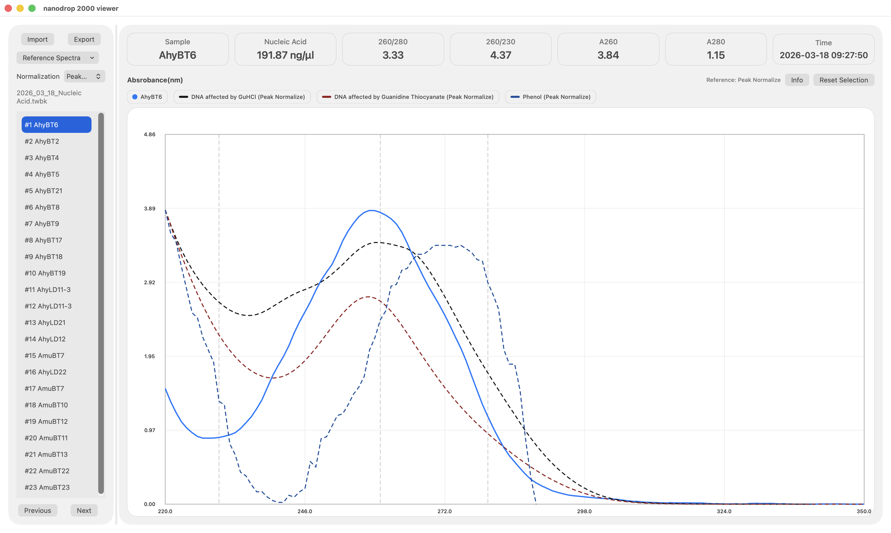

# nanodrop 2000 viewer




這是一個跨平台工具，用來開啟、檢視、比對與匯出 NanoDrop 2000 產生的 Spectrum `.tbwk` / `.twbk` 檔案。


Nanodrop是一台老古董，原廠Thermo-Fisher大概也不想再管了，但是機器沒壞只好繼續用，只是軟體真的很老舊

https://www.thermofisher.com/tw/zt/home/industrial/spectroscopy-elemental-isotope-analysis/molecular-spectroscopy/uv-vis-spectrophotometry/instruments/nanodrop/resources.html

因為nanodrop2000已經停產，Application也停止維護，並且沒有提供可供預覽Spectrum檔案的程式，每次要討論抽取的DNA/RNA/Protein時就很麻煩，而且macOS上也沒有程式可以開啟

因此我基於 https://github.com/Gillingham-Lab/tbwk-opener 的程式碼，使用Codex重新做一個同時支援三大平台的Viewer application

這個程式提供基本的nanodrop2000原廠控制軟體產生的twbk檔案預覽，你可以在macOS, Android平板或是手機、Windows10以上的電腦載入檔案看你的頻譜圖，而且也同時提供匯出為PDF功能

我只在我的macOS Tahoe 26、Android 16平板、手機，還有Windows 10上面測試過可以運行，但不敢保證所有裝置都能跑。

iPad、iPhone抱歉目前還沒有支援，因為iOS本身限制很多，要能夠上架還得付Apple一筆錢(約台幣 3,000 左右)，考量這台機器用的人很少，搞不好每年繳3000元Apple Developer還不夠XD

目前提供：

- macOS 原生版本(Universal binary)
- Android 原生版本
- Windows 原生版本

你只要點選nanodrop產生的twbk檔案就能看到你的spectrum頻譜圖，如果直接點檔案不會自動開啟，那就用程式內的Import功能就能載入檔案

程式同時提供Export功能，可以把吸光值、濃度等資訊輸出為CSV檔案方便你後面分析


## 功能特色

本專案用於 NanoDrop 2000 測量結果的讀取與分析，主要功能包括：

- 可直接開啟 `.tbwk` / `.twbk` 檔案
- 可讀取每個樣本的吸光光譜資料，包括 x 軸與 y 軸數值
- 可顯示量測摘要資料，例如：
  - Sample
  - Nucleic Acid
  - A260
  - A280
  - 260/280
  - 260/230
  - Time
- 光譜圖固定顯示於 `220-350 nm`
- 在 `230`、`260`、`280 nm` 加上參考虛線，方便判讀 peak 是否偏移
- 支援 reference spectrum 疊圖比較
- 支援多種 reference normalization 模式：
  - Peak Normalize
  - Area Normalize
  - Fit To Sample
- 可匯出：
  - summary CSV
  - spectrum CSV
  - spectra PDF

## 安裝方式

請至 GitHub Releases 下載對應平台版本：

- macOS：下載 `.dmg`
- Android：下載 `.apk`
- Windows：下載 `.zip` 或 installer

## 使用方式

一般使用流程如下：

1. 開啟程式
2. 匯入 `.tbwk` 或 `.twbk` 檔案
3. 在樣本清單中選擇樣本
4. 檢視吸光光譜與摘要數值
5. 視需要疊加 reference spectrum 進行比對
6. 匯出 CSV 或 PDF

## 平台說明

### macOS

- 原生 Swift app
- Universal binary，同時支援：
  - `arm64`（Apple Silicon）
  - `x86_64`（Intel）
- 提供 `.dmg` 安裝檔
- 開啟 `.dmg` 後，可直接把 `nanodrop 2000 viewer.app` 拖曳到 `Applications`
- 支援 `.tbwk` / `.twbk` 檔案關聯


如果 macOS 顯示無法開啟，通常是因為 Gatekeeper 對未簽名 app 的保護機制。可用以下方式處理：

1. 在App按右鍵，選Open

2. 開啟Terminal執行

```bash
xattr -dr com.apple.quarantine "/Applications/nanodrop 2000 viewer.app"
```

3.如果還是不行，再加上

開啟Terminal執行
```bash
codesign --force --deep --sign - "/Applications/nanodrop 2000 viewer.app"
```


### Android

- 原生 Android app
- 支援橫向與直向版面
- 可直接在裝置上解析 `.tbwk`
- 可匯出到裝置文件資料夾
- 支援 `.tbwk` / `.twbk` 檔案關聯

Android 安裝 `.apk` 時，系統可能會提示「不明來源應用程式」或阻擋安裝。這是 Android 的正常安全機制。只要在安裝時允許目前使用的瀏覽器或檔案管理器安裝未知應用程式即可。

### Windows

- 原生 C# / WPF app
- 可直接讀取 `.tbwk`
- 支援 reference spectrum database
- 支援 Windows 檔案關聯

Windows 第一次執行未簽名程式時，可能會出現 SmartScreen 警告。這是 Windows 的正常保護機制。若你是從本專案 GitHub Releases 下載，可選擇：

1. 點選 `More info`
2. 再點選 `Run anyway`

若是 `.zip` 檔下載後被標記，也可以先在檔案內容中解除封鎖：

1. 右鍵檔案
2. 點選 `內容`
3. 勾選 `解除封鎖`（如果有出現）
4. 再解壓縮執行

## Reference spectrum database

本專案使用共用的 [spectrum_database](/Users/savannachow/Github/tbwk-opener/spectrum_database) 作為 reference spectra 資料來源，目前可支援例如：

- Phenol
- Guanidine HCl
- Guanidine thiocyanate
- EDTA
- Ethanol
- Protein (BSA)

這些 reference spectrum 可與實際量測樣本疊圖比較，不過目前建議當作外加的功能，因為這些污染物的spectrum尚未建立完成。
如果想知道污染物來源，可以按下Info的按鈕，裡面有一些說明。

## 專案結構

- [Sources](/Users/savannachow/Github/tbwk-opener/Sources)
  macOS app、Swift core 與 CLI 原始碼
- [android-app](/Users/savannachow/Github/tbwk-opener/android-app)
  Android app 原始碼
- [windows-app](/Users/savannachow/Github/tbwk-opener/windows-app)
  Windows app 原始碼
- [spectrum_database](/Users/savannachow/Github/tbwk-opener/spectrum_database)
  三個平台共用的 reference spectrum database
- [scripts](/Users/savannachow/Github/tbwk-opener/scripts)
  建置、打包與同步腳本
- [examples](/Users/savannachow/Github/tbwk-opener/examples)
  範例 `.tbwk` 檔案
- [tests](/Users/savannachow/Github/tbwk-opener/tests)
  測試與測試資料

## 建置方式

### macOS

```bash
./scripts/build-nanodrop-viewer-mac-app.sh
```

### Android

```bash
cd android-app
./gradlew assembleDebug
```

### Windows

請在 Windows 電腦上執行：

```powershell
cd windows-app
Set-ExecutionPolicy -Scope Process -ExecutionPolicy Bypass
.\build-windows-app.ps1 -SelfContained -SingleFile -ZipOutput
```

## Release

正式發佈以 `main` branch 為主，相關打包、命名與 release 流程請參考：

- [RELEASING.md](/Users/savannachow/Github/tbwk-opener/RELEASING.md)
